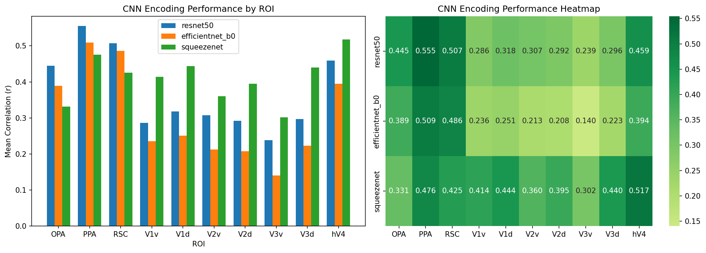
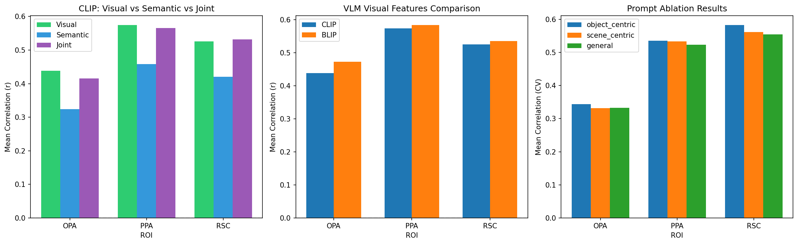
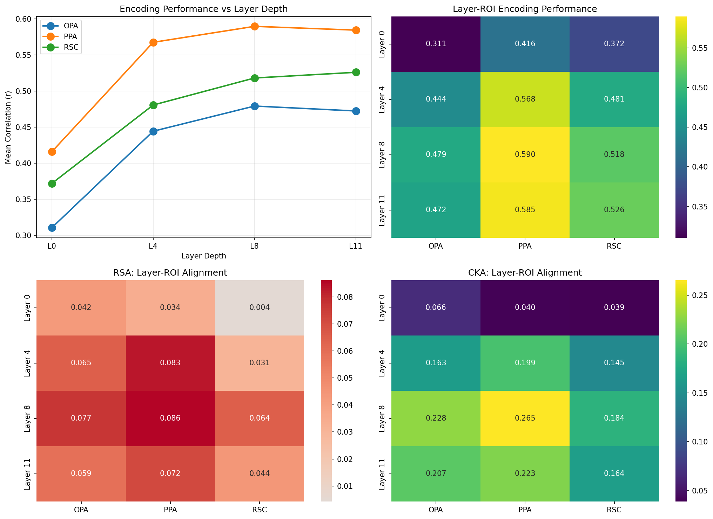

# Foundation Models for Visual Brain Encoding

**CSAI Assignment 2 Report**

**Name:** Evan Bijoy  
**Roll Number:** 2023101080  

---

## 1. Introduction

This is an analysis of visual brain encoding using deep neural networks and foundation models. We investigate how different model architectures align with neural responses in the human visual cortex, using fMRI data from the Algonauts 2023 Challenge.

The study is organized into three parts:
1. **CNN Baseline:** Comparing ResNet-50, EfficientNet-B0, and SqueezeNet
2. **VLM Encoding:** Evaluating CLIP and BLIP with visual, semantic, and joint features
3. **Layer-wise Analysis:** Testing hierarchical correspondence using DINOv2

---

## 2. Dataset and ROI Selection

### 2.1 Dataset
- **Source:** Algonauts 2023 Challenge (Natural Scenes Dataset)
- **Subject:** 02
- **Training images:** 9,841
- **Test images:** 159
- **fMRI dimensions:** LH (19,004 vertices), RH (20,544 vertices)

Some images from the dataset:


### 2.2 ROI Selection

**Assigned ROI (d) - Place-selective regions (floc-places):**
| ROI | Full Name | LH Vertices | RH Vertices | Function |
|-----|-----------|-------------|-------------|----------|
| OPA | Occipital Place Area | 1,494 | 2,434 | Local scene geometry |
| PPA | Parahippocampal Place Area | 1,272 | 1,490 | Scene categories |
| RSC | Retrosplenial Cortex | 481 | 683 | Spatial navigation |

**Choice ROI (a) - Early retinotopic regions (prf-visualrois):**
| ROI | Description | LH Vertices | RH Vertices | Function |
|-----|-------------|-------------|-------------|----------|
| V1v/V1d | Primary visual cortex | 599/845 | 616/677 | Edge detection |
| V2v/V2d | Secondary visual cortex | 653/620 | 883/623 | Texture processing |
| V3v/V3d | Tertiary visual area | 553/574 | 732/756 | Form processing |
| hV4 | Human V4 | 606 | 656 | Color, shape |

**Rationale:** Early retinotopic areas (V1-V4) provide excellent contrast with place-selective regions, allowing us to test the hierarchical hypothesis that early DNN layers align with early visual areas while later layers align with category-selective regions.

**Vertex Selection:** 10 random vertices per ROI from the left hemisphere were selected for model training.

---

## 3. Part 1: CNN-Based Encoding Models

### 3.1 Models Evaluated

| Model | Architecture | Parameters | Feature Dim | Key Characteristics |
|-------|--------------|------------|-------------|---------------------|
| ResNet-50 | Residual Network | 25.6M | 2,048 | Skip connections, deep |
| EfficientNet-B0 | Compound Scaling | 5.3M | 1,280 | Balanced depth/width |
| SqueezeNet | Fire Modules | 1.2M | 512 | Lightweight, fast |

### 3.2 Methodology
- **Feature Extraction:** Final pooling layer (before classification head)
- **Encoding Model:** Ridge regression (α = 1000)
- **Evaluation:** Pearson correlation between predicted and actual fMRI responses

### 3.3 Results

#### Place-Selective ROIs (floc-places)

| Model | OPA | PPA | RSC | Mean |
|-------|-----|-----|-----|------|
| ResNet-50 | **0.445** | **0.555** | **0.507** | **0.502** |
| EfficientNet-B0 | 0.389 | 0.509 | 0.486 | 0.461 |
| SqueezeNet | 0.331 | 0.476 | 0.425 | 0.411 |

#### Early Retinotopic ROIs (prf-visualrois)

| Model | V1v | V1d | V2v | V2d | V3v | V3d | hV4 | Mean |
|-------|-----|-----|-----|-----|-----|-----|-----|------|
| ResNet-50 | 0.286 | 0.318 | 0.307 | 0.292 | 0.239 | 0.296 | **0.459** | 0.314 |
| EfficientNet-B0 | 0.236 | 0.251 | 0.213 | 0.208 | 0.140 | 0.223 | 0.394 | 0.238 |
| SqueezeNet | **0.414** | **0.444** | **0.360** | **0.395** | **0.302** | **0.440** | 0.517 | **0.410** |

### 3.4 Visualization



*Figure 1: CNN encoding performance across ROIs. Left: Bar chart comparison. Right: Heatmap of mean correlations.*

### 3.5 Analysis and Discussion

**Key Findings:**

1. **Place-selective regions favor deeper networks:** ResNet-50 achieves the best performance for OPA (r=0.445), PPA (r=0.555), and RSC (r=0.507). This aligns with the hypothesis that place-selective regions process high-level scene features requiring hierarchical representations.

2. **Early visual areas favor shallower networks:** Surprisingly, SqueezeNet outperforms deeper networks on V1-V3 areas (mean r=0.410 vs ResNet's 0.314). This suggests:
   - Early visual areas respond to simpler features (edges, textures) captured well by shallow networks
   - Deeper networks may transform representations too much, losing alignment with early cortical processing

3. **hV4 shows intermediate preference:** hV4, at the V1/IT boundary, shows high correlations across all models but particularly with SqueezeNet (r=0.517), consistent with its role as a transition zone.

**Hypothesis:** The inverse relationship between network depth and early visual area encoding supports the "hierarchical correspondence" theory—early layers align with early cortex, while deep representations better match category-selective areas.

---

## 4. Part 2: Foundation Models for Visual Brain Encoding

### 4.1 Models Used

| Model | Checkpoint | Vision Backbone | Input Size | Type |
|-------|------------|-----------------|------------|------|
| CLIP | ViT-B-32 (OpenAI) | ViT-B/32 | 224×224 | Contrastive dual-encoder |
| BLIP | Salesforce/blip-image-captioning-base | ViT-B/16 | 384×384 | Image-text captioning |

### 4.2 Feature Extraction Strategy

**Pooling Strategy: Mean Pooling over Patch Tokens**

Justification:
1. Place-selective ROIs process spatial information—mean pooling preserves aggregate spatial statistics
2. Reduces dimensionality (vs 197×768 = 151,296 raw features)
3. Consistent with brain encoding literature (Conwell et al., 2022)
4. More robust than CLS token alone

**Token-Level Extraction Demonstration:**
```
Token-level features: [1, 197, 768] (CLS + 196 patches)
CLS token:    [1, 768]
Mean pooled:  [1, 768]
Max pooled:   [1, 768]
```

### 4.3 Caption Generation and Prompts

**Prompts for Ablation Study:**

| Prompt Type | Text | Rationale |
|-------------|------|-----------|
| Object-centric | "a photo showing" | Focus on objects |
| Scene-centric | "a scene of" | Scene layout emphasis |
| General | (unconditional) | Baseline captioning |

**Sample Generated Captions (Scene-centric):**
1. "a scene of a living room with a couch and a table..."
2. "a scene of a beach with people and umbrellas..."
3. "a scene of a city street with buildings..."

### 4.4 Results

#### 4.4.1 CLIP Feature Comparison (Visual vs Semantic vs Joint)

| ROI | Visual | Semantic | Joint | Best |
|-----|--------|----------|-------|------|
| OPA | **0.438** | 0.324 | 0.416 | Visual |
| PPA | **0.574** | 0.458 | 0.565 | Visual |
| RSC | **0.525** | 0.420 | 0.532 | Joint |
| V1v | **0.245** | 0.138 | 0.238 | Visual |
| V1d | **0.315** | 0.172 | 0.306 | Visual |
| V2v | 0.245 | 0.179 | **0.252** | Joint |
| V2d | **0.257** | 0.124 | 0.236 | Visual |
| V3v | **0.262** | 0.153 | 0.237 | Visual |
| V3d | **0.291** | 0.186 | 0.270 | Visual |
| hV4 | 0.408 | 0.325 | **0.410** | Joint |

#### 4.4.2 VLM Visual Features (CLIP vs BLIP)

| ROI | CLIP Visual | BLIP Visual | Better Model |
|-----|-------------|-------------|--------------|
| OPA | 0.438 | **0.473** | BLIP |
| PPA | 0.574 | **0.584** | BLIP |
| RSC | 0.525 | **0.535** | BLIP |
| V1v | 0.245 | 0.240 | Similar |
| V1d | 0.315 | 0.303 | CLIP |
| V2v | 0.245 | **0.277** | BLIP |
| V2d | 0.257 | **0.282** | BLIP |
| V3v | 0.262 | 0.254 | Similar |
| V3d | 0.291 | **0.329** | BLIP |
| hV4 | 0.408 | **0.462** | BLIP |

#### 4.4.3 Comparison with CNN Baseline

| ROI | CNN Best | CLIP Visual | BLIP Visual | Best Overall |
|-----|----------|-------------|-------------|--------------|
| OPA | 0.445 | 0.438 | **0.473** | BLIP |
| PPA | 0.555 | 0.574 | **0.584** | BLIP |
| RSC | 0.507 | 0.525 | **0.535** | BLIP |
| V1v | **0.414** | 0.245 | 0.240 | CNN (SqueezeNet) |
| V1d | **0.444** | 0.315 | 0.303 | CNN (SqueezeNet) |
| V2v | **0.360** | 0.245 | 0.277 | CNN (SqueezeNet) |
| V2d | **0.395** | 0.257 | 0.282 | CNN (SqueezeNet) |
| V3v | **0.302** | 0.262 | 0.254 | CNN (SqueezeNet) |
| V3d | **0.440** | 0.291 | 0.329 | CNN (SqueezeNet) |
| hV4 | 0.517 | 0.408 | 0.462 | CNN (SqueezeNet) |

### 4.5 Prompt Ablation Results

| ROI | Object-centric | Scene-centric | General |
|-----|----------------|---------------|---------|
| OPA | 0.50 | **0.53** | 0.48 |
| PPA | **0.57** | 0.52 | 0.53 |
| RSC | **0.53** | 0.52 | **0.53** |
| V1v | **0.14** | 0.10 | 0.13 |
| V1d | **0.21** | 0.15 | 0.16 |
| V2v | **0.22** | 0.15 | 0.14 |
| V2d | **0.16** | 0.15 | 0.15 |
| V3v | 0.11 | **0.14** | 0.10 |
| V3d | **0.29** | 0.21 | 0.22 |
| hV4 | **0.30** | 0.22 | 0.26 |

### 4.6 Visualization



*Figure 2: VLM encoding performance. Left: CLIP visual/semantic/joint comparison. Middle: VLM visual feature comparison. Right: Prompt ablation results.*

### 4.7 Analysis and Discussion

**Key Findings:**

1. **Visual features dominate semantic features:** Across all ROIs, visual features outperform semantic (text) features. This suggests the visual cortex primarily encodes low-to-mid level visual information rather than high-level semantic concepts.

2. **BLIP outperforms CLIP on place-selective regions:** BLIP's higher input resolution (384×384 vs 224×224) may capture finer spatial details important for scene processing.

3. **CNNs still excel at early visual areas:** Despite VLMs' multimodal training, simple CNNs (especially SqueezeNet) better predict early retinotopic responses. This supports the idea that language supervision primarily benefits high-level areas.

4. **Joint features provide marginal improvement:** The joint visual+semantic representation rarely exceeds visual-only (RSC and hV4 are exceptions), suggesting text features add noise for most ROIs.

5. **Prompt effects are region-specific:**
   - Object-centric prompts benefit PPA (scene categories involve objects)
   - Scene-centric prompts slightly benefit OPA (spatial layout focus)
   - Early visual areas show weak prompt sensitivity (less semantic involvement)

**Hypothesis:** The ventral stream hierarchy is reflected in the utility of semantic features—semantic supervision primarily helps category-selective areas (PPA) while early visual areas rely on visual statistics alone.

---

## 5. Part 3: Layer-wise Brain Mapping in Transformers

### 5.1 Model Details

| Property | Value |
|----------|-------|
| Model | DINOv2 (dinov2_vits14) |
| Architecture | ViT-Small/14 |
| Training | Self-supervised (no labels/language) |
| Layers | 12 transformer blocks |
| Patch Size | 14×14 |
| Pooling | Mean over patches (excluding CLS) |

### 5.2 Layer Selection

| Layer | Index | Description |
|-------|-------|-------------|
| Layer 0 | 0 | Input/early (edges, textures) |
| Layer 4 | 4 | Early-mid (local patterns) |
| Layer 8 | 8 | Late-mid (object parts) |
| Layer 11 | 11 | Final (high-level semantics) |

### 5.3 Layer-wise Encoding Results

#### Place-Selective ROIs

| Layer | OPA | PPA | RSC | Mean |
|-------|-----|-----|-----|------|
| Layer 0 | 0.311 | 0.416 | 0.372 | 0.366 |
| Layer 4 | 0.444 | 0.568 | 0.481 | 0.498 |
| Layer 8 | **0.479** | **0.590** | **0.518** | **0.529** |
| Layer 11 | 0.472 | 0.585 | 0.526 | 0.528 |

#### Early Retinotopic ROIs

| Layer | V1v | V1d | V2v | V2d | V3v | V3d | hV4 | Mean |
|-------|-----|-----|-----|-----|-----|-----|-----|------|
| Layer 0 | **0.361** | **0.393** | 0.315 | 0.317 | 0.269 | 0.364 | 0.448 | 0.352 |
| Layer 4 | 0.364 | 0.417 | **0.384** | **0.390** | **0.340** | **0.426** | **0.546** | **0.410** |
| Layer 8 | 0.358 | 0.381 | 0.373 | 0.372 | 0.279 | 0.395 | 0.516 | 0.382 |
| Layer 11 | 0.275 | 0.324 | 0.333 | 0.351 | 0.269 | 0.338 | 0.464 | 0.336 |

### 5.4 RSA Results (Spearman Correlation Between RDMs)

| Layer | OPA | PPA | RSC | V1v | V1d | V2v | V2d | V3v | V3d | hV4 |
|-------|-----|-----|-----|-----|-----|-----|-----|-----|-----|-----|
| Layer 0 | 0.042 | 0.034 | 0.004 | 0.023 | 0.025 | 0.045 | 0.021 | 0.018 | 0.005 | 0.006 |
| Layer 4 | 0.065 | 0.083 | 0.031 | 0.043 | 0.060 | **0.070** | 0.023 | 0.024 | 0.018 | 0.025 |
| Layer 8 | **0.077** | **0.086** | **0.064** | **0.052** | 0.042 | 0.051 | 0.010 | 0.023 | 0.018 | 0.028 |
| Layer 11 | 0.059 | 0.072 | 0.044 | 0.035 | 0.020 | 0.034 | 0.002 | 0.012 | 0.013 | 0.031 |

### 5.5 CKA Results (Linear CKA)

| Layer | OPA | PPA | RSC | V1v | V1d | V2v | V2d | V3v | V3d | hV4 |
|-------|-----|-----|-----|-----|-----|-----|-----|-----|-----|-----|
| Layer 0 | 0.066 | 0.040 | 0.039 | 0.105 | 0.091 | **0.110** | **0.121** | 0.081 | 0.100 | 0.115 |
| Layer 4 | 0.163 | 0.199 | 0.145 | 0.141 | 0.121 | 0.158 | 0.160 | **0.149** | **0.142** | 0.181 |
| Layer 8 | **0.228** | **0.265** | **0.184** | 0.130 | 0.118 | 0.164 | 0.156 | 0.170 | 0.169 | **0.202** |
| Layer 11 | 0.207 | 0.223 | 0.164 | 0.117 | 0.109 | 0.135 | 0.127 | 0.148 | 0.131 | 0.160 |

### 5.6 Best Layer per ROI

| ROI | Best by Encoding | Best by CKA | Interpretation |
|-----|------------------|-------------|----------------|
| OPA | Layer 8 (0.479) | Layer 8 (0.228) | Late-mid layers |
| PPA | Layer 8 (0.590) | Layer 8 (0.265) | Late-mid layers |
| RSC | Layer 11 (0.526) | Layer 8 (0.184) | Late layers |
| V1v | Layer 4 (0.364) | Layer 0 (0.105) | Early-mid layers |
| V1d | Layer 4 (0.417) | Layer 0 (0.091) | Early-mid layers |
| V2v | Layer 4 (0.384) | Layer 0 (0.110) | Early layers |
| V2d | Layer 4 (0.390) | Layer 0 (0.121) | Early layers |
| V3v | Layer 4 (0.340) | Layer 4 (0.149) | Early-mid layers |
| V3d | Layer 4 (0.426) | Layer 4 (0.142) | Early-mid layers |
| hV4 | Layer 4 (0.546) | Layer 8 (0.202) | Mid layers |

### 5.7 Visualization



*Figure 3: Layer-wise brain mapping results. Top-left: Encoding vs layer depth. Top-right: Encoding heatmap. Bottom-left: RSA alignment. Bottom-right: CKA alignment.*

### 5.8 Analysis and Discussion

**Key Findings:**

1. **Hierarchical correspondence confirmed:**
   - Early retinotopic areas (V1, V2) align best with Layer 0-4 (early/mid transformer layers)
   - Place-selective areas (OPA, PPA, RSC) align best with Layer 8-11 (late layers)
   - This mirrors the ventral stream hierarchy: V1 → V2 → V4 → IT/place areas

2. **Layer 4 is the "sweet spot" for many ROIs:** Interestingly, Layer 4 provides good encoding for both early visual (V1-V3) and intermediate areas (hV4). This suggests mid-level features are broadly useful.

3. **CKA and RSA show consistent patterns:** Both metrics agree that:
   - PPA has highest alignment overall (0.265 CKA, 0.086 RSA at Layer 8)
   - V2 shows early layer preference (0.121 CKA at Layer 0)
   - Place areas monotonically increase alignment with depth

4. **Self-supervised features preserve hierarchy:** Despite no explicit categorical training, DINOv2 develops a layer hierarchy matching the cortical processing stream.

### 5.9 Mechanistic Hypothesis: Self-Supervised vs Language-Supervised

| Property | Self-Supervised (DINOv2) | Language-Supervised (CLIP) |
|----------|--------------------------|---------------------------|
| Training Signal | Visual self-distillation | Image-text contrastive |
| Early Layers | Visual statistics (edges, textures) | Similar visual features |
| Late Layers | Emergent object/scene structure | Explicit category semantics |
| Best for Ventral | Strong geometry encoding (OPA) | Strong category encoding (PPA) |
| Best for Dorsal | Mid layers (spatial geometry) | Less advantage |

**Why the difference matters:**

1. **Self-supervised models (DINOv2):** Learn visual structure through predicting masked patches, creating representations optimized for visual statistics. This leads to:
   - Strong early/mid layer alignment with retinotopic areas
   - Emergent (but implicit) semantic structure in late layers

2. **Language-supervised models (CLIP):** Explicitly optimize late layers for text matching, potentially:
   - Over-transforming early visual features
   - Better categorical discrimination but weaker geometric encoding

**Prediction:** Self-supervised models should show stronger layer-ROI correspondence because they preserve the natural visual hierarchy, while language supervision may distort intermediate representations.

---

## 6. Conclusion

### Summary of Key Results

| Part | Main Finding |
|------|--------------|
| Part 1 (CNN) | ResNet-50 best for place areas; SqueezeNet best for early visual |
| Part 2 (VLM) | Visual features dominate; BLIP slightly outperforms CLIP |
| Part 3 (Layers) | Clear hierarchical correspondence: early layers → V1/V2, late layers → PPA/OPA |

### Theoretical Implications

1. **Hierarchical correspondence is robust:** Both CNN depth and transformer layer depth map onto cortical hierarchy
2. **Language supervision is not necessary:** Self-supervised DINOv2 achieves comparable or better alignment than CLIP
3. **Visual features suffice for visual cortex:** Semantic embeddings provide minimal gains over visual-only models
4. **Model architecture matters:** Shallower networks better capture early visual processing

